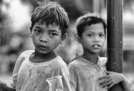

# Black and White Image Colorization

## Overview
This project implements a deep learning-based approach to colorize black and white images using a pre-trained Caffe model. The model takes a grayscale image as input and predicts the missing color channels to generate a realistic colorized version of the image.

## Features
- Uses a deep learning model trained on large-scale datasets.
- Converts grayscale images to color using OpenCV's DNN module.
- Resizes images while maintaining aspect ratio.
- Supports pre-trained Caffe models for colorization.
- Displays both the original grayscale and the colorized images.

## Technologies Used
- Python
- OpenCV
- NumPy
- Caffe (Pre-trained Deep Learning Model)

## Installation & Setup
### Prerequisites
Ensure you have the following installed:
- Python 3.x
- OpenCV
- NumPy

### Steps
1. **Clone the repository**:
   ```sh
   git clone https://github.com/your-repo/bw2color.git
   cd bw2color
   ```
2. **Install dependencies**:
   ```sh
   pip install opencv-python numpy argparse
   ```
3. **Download Pre-trained Model Files**:
   - Download the required files:
     - `colorization_deploy_v2.prototxt`
     - `colorization_release_v2.caffemodel`
     - `pts_in_hull.npy`
   - Place them inside a `model/` directory.

## Usage
Run the script using the following command:
```sh
python bw2color_image.py --prototxt model/colorization_deploy_v2.prototxt --model model/colorization_release_v2.caffemodel --points model/pts_in_hull.npy --image images/test2.jpeg
```

## Input & Output
**Input:** A black and white image.

**Output:** A colorized version of the image.

## Example
### Input Image


### Output Image


## Future Enhancements
- Implementing real-time video colorization.
- Adding a web-based interface for easy usability.
- Improving color accuracy using fine-tuned models.

